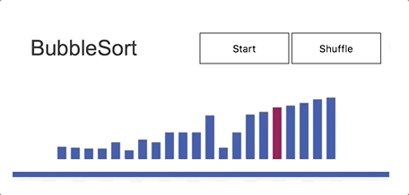

# Algorithms Animated
This project is a collection of animation for basic algorithms.

## Algorithms
### Sorts
- [x] Bubble Sort
- [ ] Quick Sort
- [ ] Merge Sort
- [ ] Insertion Sort

### Search
- [ ] Binary Search
- [ ] Linear Search
- [ ] Jump Search

### Graphs
- [ ] BFS
- [ ] DFS

## Example

## Technology

- Vanilla JavaScript for animation and scripts
- HTML 5 Canvas for rendering
- Webpack for bundling javascript and sass

## Implementation Timeline
### Prior to the project
- Created the skeleton for the animations
- Created Bubble Sort Animation
### Day 1
- Finish Quick Sort animation with partitioning
- Implement Insertion Sort

### Day 2
- Implement Merge Sort
- Create skeleton for graph drawing

### Day 3
- Implement Binary Search
- Implement Linear Search

### Day 4
- Create Page to present the animations
- Implement Jump Search

### Bonus
- Implement DFS
- Implement BFS

